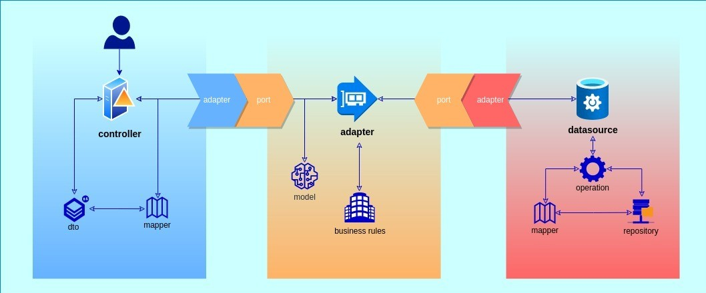
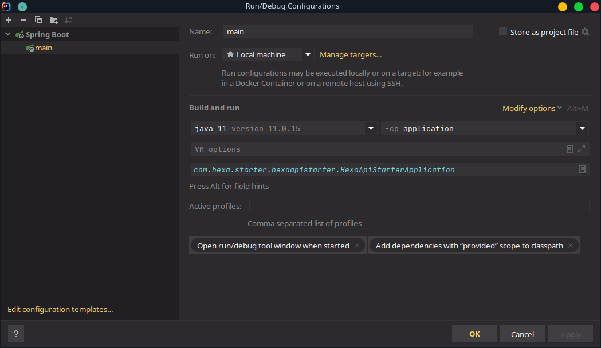

# Hexagonal Architecture Starter


<br />
[](https://sonarcloud.io/summary/new_code?id=laasilva_hexagonal-api-starter)
[](https://sonarcloud.io/summary/new_code?id=laasilva_hexagonal-api-starter)
[](https://sonarcloud.io/summary/new_code?id=laasilva_hexagonal-api-starter)
[](https://sonarcloud.io/summary/new_code?id=laasilva_hexagonal-api-starter)
[](https://sonarcloud.io/summary/new_code?id=laasilva_hexagonal-api-starter)
[](https://sonarcloud.io/summary/new_code?id=laasilva_hexagonal-api-starter)

## Overview
This is a reference project for setting up a new Hexagonal based Spring Boot Java project. This sample starter is used whenever I want to start a new project - simply clone it and replace it's properties and rename packages to match your application.

## Making Hexagonal Simple
This is a simple solution for a challenge I faced recently: I heard the term *Hexagonal Architecture* for the first time in December last year, prior to starting as a mid-level Java analyst on a new company - naturally, I started to do my own research, and found a :sparkles:*beautiful*:sparkles: new way of creating REST APIs.
### But after all, what exactly is an hexagonal application?
Explaining the hexagonal concept is simple: All you have to do is separate your layers.

What I mean by this is, we basically have to divide our application by tiers, and each tier will have their own concern, each tier will have their own dependencies, therefore each tier will only consume what they absolutely need to.

This application has three main tiers: Driving side (application), Domain side (core) and Driven side (datasource)
- Driving side: This tier is responsible for all of the user interface, basically everything that will be consumed and returned for external use - controllers and DTOs. This layer will be adapted to the domain side through the controller, our adapter;
- Domain side: The Domain tier is responsible for the business side of the application, acting as the literal port between the driving and driven tiers. Here, we'll have the use cases, models, and ports.
- Driven side: This last but least one is responsible for everything concerning data, being the bearer of entities and repositories, as well as database configuration.



### Got it, but *why* should I use Hexagonal?
As a :sparkles:*very helpful*:sparkles: article published over at SSENSE-TECH would say,
> There are many advantages of using [Hexagonal architecture], one of them is to be able to completely isolate your application logic and domain logic in a fully testable way. Since it does not depend on external factors, testing it becomes natural and mocking its dependencies is easy.
>
> It also lets you design all your system’s interfaces ‘by purpose’ rather than by technology, preventing you from lock-in, and making it easier for your application’s tech stack to evolve with time. If you need to change the persistence layer, go for it. If you need to allow your app to be called by Slack bots instead of humans, you got it! All you need to do is implement new Adapters and you’re good to go.

### *And now that I convinced you...* :wink::wink:
## Setup
To run this project, all you need is JDK11 installed and, depending on how you want to run it, you'll also need to install maven.
### Using Your IDE
If you use Intellij Idea, you can import the project, and after the indexing is done, you can  download and generate sources using the Maven plugin.

After those two simple steps, you'll only have to setup your Run/Debug Configurations to execute the **aplication** project as your main one - if in doubt, try and match my configurations:



### Using Your Terminal

If you're like me, and sometimes you like to go oldschool and use more terminal commands to look :sunglasses:*cool*:sunglasses: like the true Elliot Alderson you are, you can run the application by (making sure you have maven installed, of course, and) using the following commands and you'll be all set:
```sh
mvn clean install
cd application
mvn spring-boot:run
```
#### Dig deeper

If you want to generate Test Coverage reports, use the following command:

```sh
mvn verify
```
After that, just check your target/site/jacoco directory and open the index.html in your favorite browser.

---
If you want to generate a site that sums up all of the maven repositories for the project, alongside the Coverage Reports, use following command:

```sh
mvn site
```
## Conclusion
This starter project was made for studies intent, :blue_heart:*lots of love*:blue_heart: and a tad of alcohol - hopefully will be used for a future project of mine, which will take a lot of energy out of my few working brain cells.

Hexagonal Architecture has been the main focus of all of my researches for the past months, so after the initial commit I'll continue to study and (hopefully) be able to upgrade this project with better usages and improved performance.

## Support

Please enter an issue in the repo for any questions or problems.
Alternatively, you can catch me over at my social medias.

<a href="https://linkedin.com/in/cmdrlias/"></a>
<a href="https://twitter.com/nickeldumbb"></a>
<a href="https://instagram.com/larssslv"></a>
